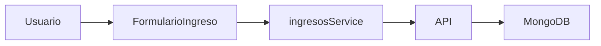

# 💰 Flujo de Caja Odontomed


## 📋 Descripción General

> Sistema de gestión financiera desarrollado específicamente para el control y seguimiento de ingresos. La aplicación permite registrar, visualizar y administrar los movimientos financieros con un enfoque en la categorización jerárquica de ingresos.

## 🏗️ Estructura del Proyecto

<details>
<summary><b>📁 Frontend (React + Vite)</b></summary>

```
src/
├── 🖼️ assets/              # Recursos estáticos
├── 🧩 components/          # Componentes React
│   ├── 💰 ingresos/
│   │   ├── registro/
│   │   └── Ingresos.scss
│   ├── NavBar.jsx
│   ├── Footer.jsx
│   └── PaginaInicial.jsx
├── 🔌 services/           # Servicios API
├── 🎨 styles/             # Estilos globales
└── 📱 App.jsx             # Componente principal
```

</details>

<details>
<summary><b>📁 Backend (Node.js + Express)</b></summary>

```
backend/
├── 📊 models/            # Modelos MongoDB
├── 🛣️ routes/           # Rutas API
└── 🚀 server.js         # Servidor Express
```

</details>

## 🧩 Componentes Principales

### 🏛️ Estructura Base

| Componente          | Descripción                    |
| ------------------- | ------------------------------ |
| `App.jsx`           | Componente raíz y enrutamiento |
| `NavBar.jsx`        | Barra de navegación superior   |
| `Footer.jsx`        | Pie de página                  |
| `PaginaInicial.jsx` | Página de inicio               |

### 💰 Módulo de Ingresos

#### 📋 Listado de Ingresos

- 📅 Ordenamiento por fecha
- 🔍 Visualización detallada
- ✏️ Edición de registros
- 🔔 Indicadores visuales

#### 📝 Datos Adicionales

- 🔍 Vista detallada
- 📝 Edición de observaciones
- 💾 Guardado automático
- 🔄 Actualización en tiempo real

## 🗃️ Modelos de Datos

### 💾 Ingreso Schema

```javascript
{
  fecha: Date,        // 📅 Fecha del ingreso
  importe: Number,    // 💰 Monto
  categoria: {        // 📑 Categorización
    codigo: String,
    nombre: String,
    rutaCategoria: [...]
  },
  observaciones: String // 📝 Notas adicionales
}
```

## 🔌 API y Servicios

### 🔄 Frontend Services

```javascript
// 📡 Métodos principales
getIngresos(); // 📥 Obtener listado
createIngreso(); // ➕ Crear nuevo
updateIngreso(); // 📝 Actualizar existente
```

### 🛣️ Endpoints REST

- `GET /api/ingresos` 📥
- `POST /api/ingresos` ➕
- `PUT /api/ingresos/:id` 📝

## 🎨 Estilos y Diseño

### 🎯 Características

- 📱 Diseño responsive
- 🎨 SCSS modular
- 🌈 Variables globales
- 📐 Grid system

### 🎭 Temas

```scss
// 🎨 Colores principales
$color-principal-estudio: #007bff; // 🔷 Azul
$color-principal-cliente: #28a745; // 💚 Verde
```

## ⚙️ Instalación

### 📋 Requisitos

- Node.js >= 14.x
- MongoDB >= 4.x
- npm o yarn

### 🚀 Pasos

1. **Clonar repositorio**

```bash
git clone https://github.com/AlbertoBeguier/FlujoDeCajaOdontomed.git
```

2. **Instalar dependencias**

```bash
npm install
cd backend && npm install
```

3. **Configurar variables**

```env
VITE_API_URL=http://localhost:3000
MONGODB_URI=mongodb://localhost:27017/odontomed
```

4. **Iniciar servicios**

```bash
# 🌐 Frontend
npm run dev

# 🚀 Backend
cd backend && npm start
```

## 🔄 Flujo de Datos



## 🛠️ Mantenimiento

### 📈 Posibles Extensiones

- 📊 Módulo de egresos
- 📈 Reportes estadísticos
- 📱 Dashboard administrativo
- 🔗 Integraciones externas

## 📄 Licencia

**© 2024 Estudio Beguier y Consultorio Odontomed**

> Todos los derechos reservados

## Usuarios del Sistema

### Administrador

- Usuario: alberto
- Puede crear nuevos usuarios
- Acceso total al sistema

### Usuario Normal

- Usuario: odontomed
- Acceso a operaciones regulares
